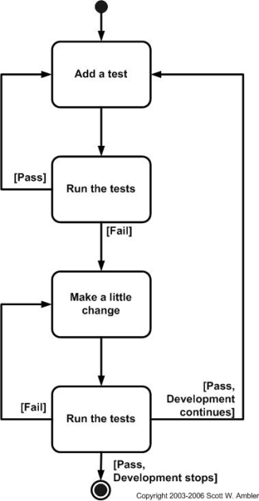

# TDD Test Driven Development

## Type of testing
- Unit Testing
- TDD


### Python has several modules that we can use
To test our code
  - PyTest
  - UnitTest

**Why TDD**
- TDD helps us minimise the risk of failure before sending the product to production

**steps**
- we will create a file to write our tests
- We will run the test and they will all fail
- we will create a file to write our code
- We will refactor and add the code to pass the tests

** Naming convention for test files and methods**
- file name simple_calc
- test_simple_calc

** install the testing frameworks**
- use pip install the testing module required
```python
pip install pytest
```

- How does `pytest` work

- pytest looks for the files with `test_*.py` and `_test*.py`
- `-v` is for verbose flag
